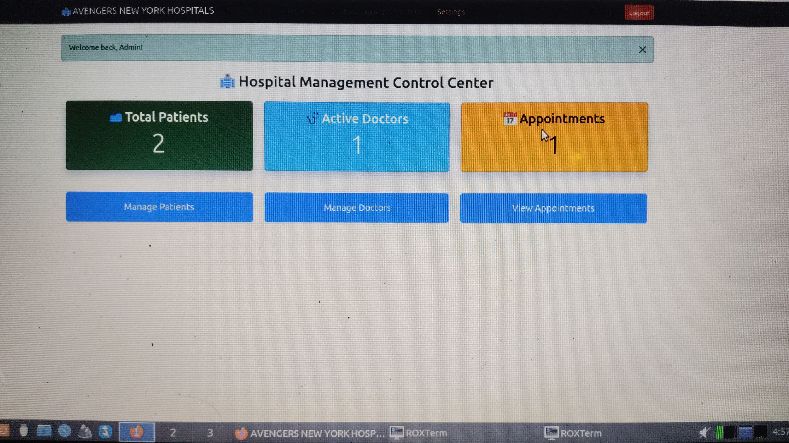
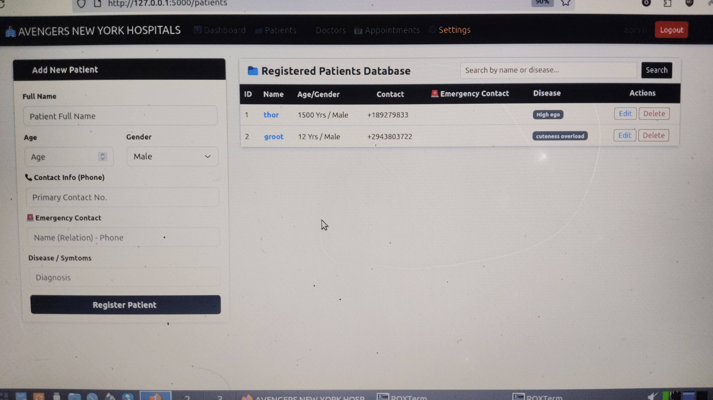
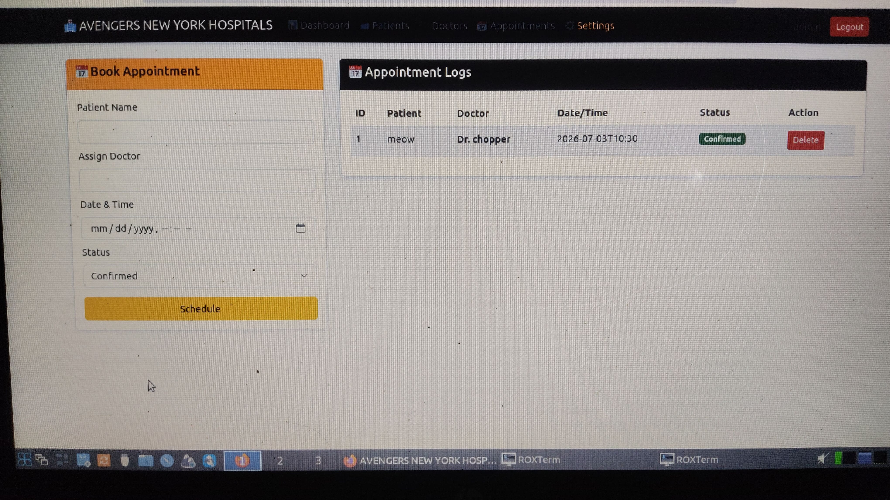

<p align="center">


<br>


</p>
<h1 align="center">🏥 Hospital Management System</h1>

<p align="center">
A lightweight, secure and modern Hospital Management System built with Python, Flask and MySQL.
</p>

<p align="center">
Made with ❤️ by <b>DOMIN-69</b>
</p>
 
Designed for clinics, hospitals, and healthcare organizations that need a simple web-based management solution.

---
## 📸 Preview

<p align="center">
  
  
  
</p>

## ✨ Features

- 🔐 Secure Admin Authentication
- 👨‍⚕️ Patient Management
- 📋 Appointment Management
- 💊 Medical Record Management
- 🏥 Hospital Information Settings
- 🗄️ MySQL Database Support
- ⚡ Lightweight & Fast
- 🌐 Easy VPS/cPanel Deployment

---

# Specially for those who use linux on phone 

### 📥 Clone the Repository

If you want to download this project using Git, run:

```bash
git clone https://github.com/DOMIN-69/Hospital_all_managment.git

```

Move into the project directory:

```bash
cd Hospital_all_management
```

Install the required dependencies:

```bash
pip install -r requirements.txt
```
# 📱 Running on Android (Termux)

This project can also be tested directly on Android using **Termux**.

---

## 1. Update Packages

```bash
pkg update && pkg upgrade -y
```

---

## 2. Install Required Packages

```bash
pkg install python git mariadb clang make pkg-config -y
```

---

## 3. Clone the Repository

```bash
git clone https://github.com/DOMIN-69/Hospital_all_managment.git
```

Move into the project directory:

```bash
cd Hospital_all_managment
```

---

## 4. Install Python Dependencies

```bash
pip install -r requirements.txt
```

---

## 5. Initialize MariaDB (First Time Only)

```bash
mariadb-install-db
```

---

## 6. Start MariaDB Server

```bash
mariadbd-safe &
```

If the above command is unavailable, try:

```bash
mysqld_safe &
```

---

## 7. Login to MariaDB

```bash
mariadb -u root
```

---

## 8. Create Database

Inside MariaDB run:

```sql
CREATE DATABASE hospital_db;
EXIT;
```

---

## 9. Import Database Schema

Make sure you are inside the project folder.

```bash
mariadb -u root hospital_db < schema.sql
```

---

## 10. Verify Database

```bash
mariadb -u root hospital_db
```

Inside MariaDB:

```sql
SHOW TABLES;
EXIT;
```

If the tables are displayed successfully, the database has been imported correctly.

---

## 11. Configure Database

Open `config.py` and update your database credentials.

Example:

```python
host = "127.0.0.1"
user = "root"
password = ""
database = "hospital_db"
port = 3306
```

If you have configured a password for your MariaDB root account, replace the empty password with your actual password.

---

## 12. Run the Application

```bash
python app.py
```

or

```bash
python3 app.py
```

---

## 13. Open the Application

Open your browser and visit:

```
http://127.0.0.1:5000
```

---

# Troubleshooting

### Can't connect to MySQL server

```
Error 2003
```

Make sure MariaDB server is running.

Start it again:

```bash
mariadbd-safe &
```

---

### Access denied for user

```
Error 1045
```

Check your database username and password inside `config.py`.

---

### Database not found

```
Unknown database hospital_db
```

Create the database first and import `schema.sql` again.

---

### Table doesn't exist

Import the schema again:

```bash
mariadb -u root hospital_db < schema.sql
```

---

## Notes

- This project uses **MariaDB** on Termux because the official MySQL server is not available in the Termux repositories.
- MariaDB is highly compatible with MySQL, so no changes to the project code are required.
- For Windows or VPS deployments, you can use either MySQL or MariaDB.
Then continue with the Database Setup section below.


# 🚀 Local Setup (Windows, Linux & VPS)

## 📥 Download Without Git

If Git is not installed on your system:

1. Click the **Code** button on this repository.
2. Select **Download ZIP**.
3. Extract the downloaded ZIP archive.
4. Open the extracted project folder.
5. Continue with the installation steps below.

---

## 1️⃣ Install Python Dependencies

Open a terminal (or Command Prompt) inside the project folder and run:

```bash
pip install -r requirements.txt
```

---

## 2️⃣ Create the Database

Open **XAMPP (phpMyAdmin)**, **MySQL Workbench**, or any MySQL/MariaDB client.

Create a new database.

Example:

```text
hospital_db
```

You may also choose any database name of your choice.

---

## 3️⃣ Import the Database Schema

Import the provided:

```text
schema.sql
```

into the database you created.

---

## 4️⃣ Configure Database Credentials

Open:

```text
config.py
```

Update the database configuration.

Example:

```python
host = "localhost"
user = "root"
password = ""
database = "hospital_db"
```

If you are using a custom MySQL username or password, replace the above values accordingly.

---

## 5️⃣ Start the Application

Run:

```bash
python app.py
```

or

```bash
python3 app.py
```

---

## 6️⃣ Open in Browser

Visit:

```text
http://127.0.0.1:5000/
```

---

# 🌍 Deploying on VPS / cPanel Hosting

## 1️⃣ Configure Production Database

Edit `config.py` and replace the local database credentials with your hosting database credentials.

Example:

```python
host = "localhost"
user = "your_database_username"
password = "your_database_password"
database = "your_database_name"
```

---

## 2️⃣ Upload Project Files

Upload the complete project using one of the following methods:

- FTP Client (FileZilla)
- cPanel File Manager
- Git Deployment

---

## 3️⃣ Create a Python Application

Log in to your **cPanel**.

Open:

```text
Setup Python App
```

Create a new Python application and configure:

- **Application Root** → Project Folder
- **Startup File** → `app.py`
- **Python Version** → 3.x

---

## 4️⃣ Install Dependencies

Inside the Python App console or terminal, run:

```bash
pip install -r requirements.txt
```

---

## 5️⃣ Restart the Application

After the installation is complete, click **Restart** inside **Setup Python App**.

Your Hospital Management System should now be live.

Finally restart the application.

---

# 🔑 Default Login

| Username | Password |
|----------|----------|
| admin | admin123 |

---

# ⚙️ Recommended After First Login

For security purposes:

- Change Admin Username
- Change Admin Password
- Update Hospital Name
- Verify settings before production use

The password field includes an **Eye Icon** to help verify your input.

---

# 📂 Project Structure

```
Hospital-Management-System/
│
├── app.py
├── config.py
├── requirements.txt
├── schema.sql
├── templates/
├── static/
└── README.md
```

---

# 🛠 Requirements

- Python 3.10+
- MySQL 8+
- Flask
- XAMPP / MySQL Workbench

---

# 📞 Support

Telegram

```
@DOMIN69ic
```

---

# 📜 License

This project is provided for educational and commercial deployment purposes.

---

# ⚠️ Notice

> **This project was originally developed as a custom solution for a client.**
